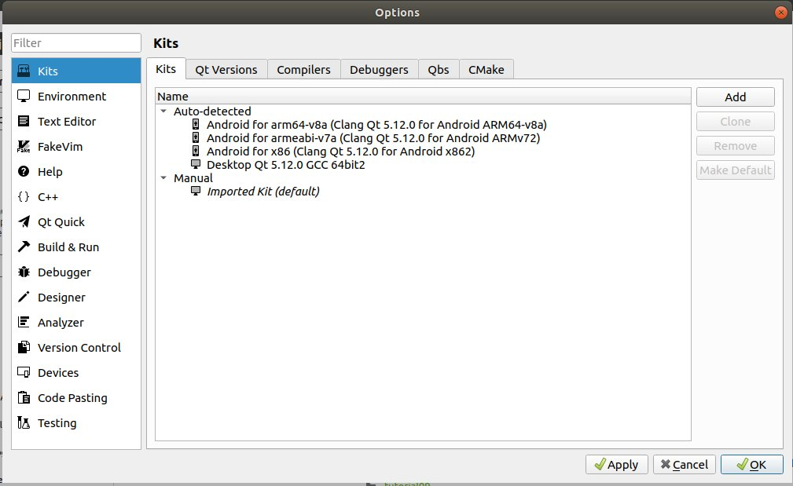
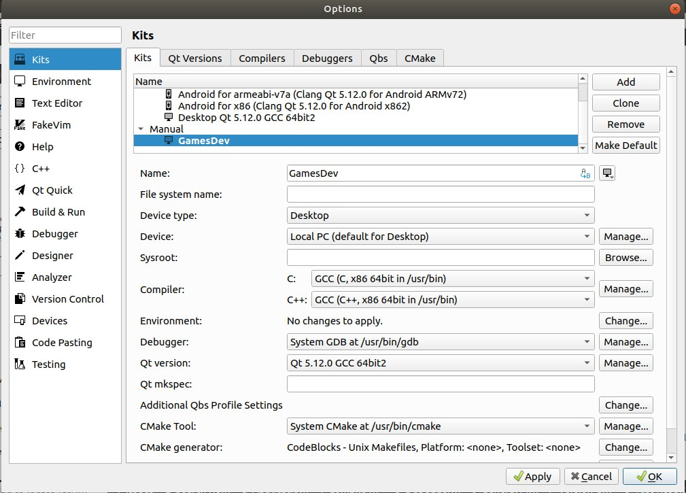
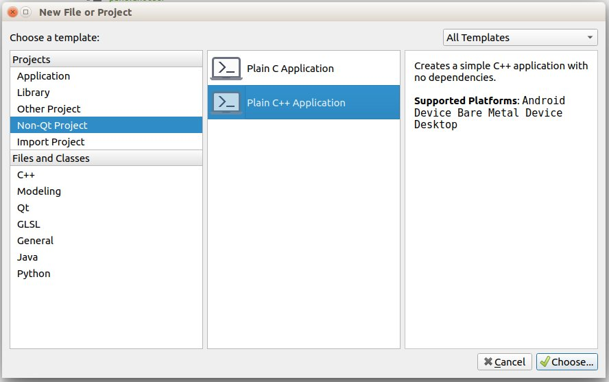
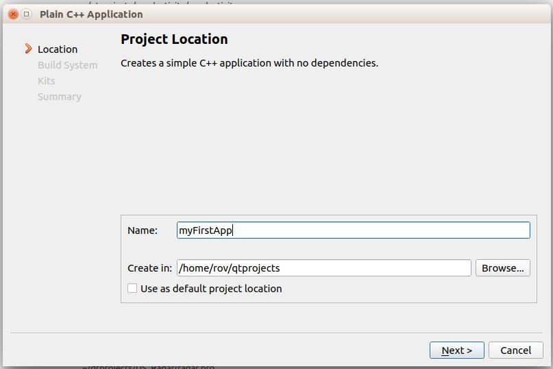
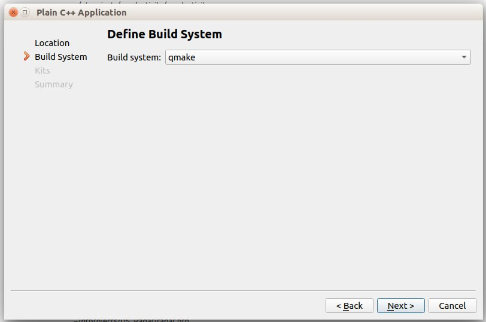
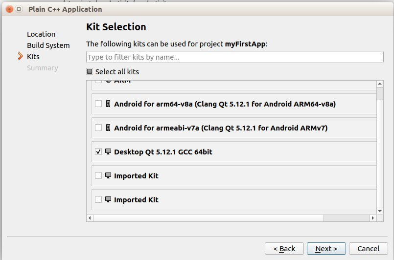
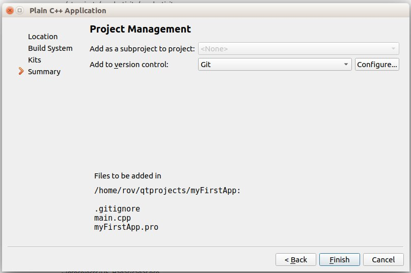
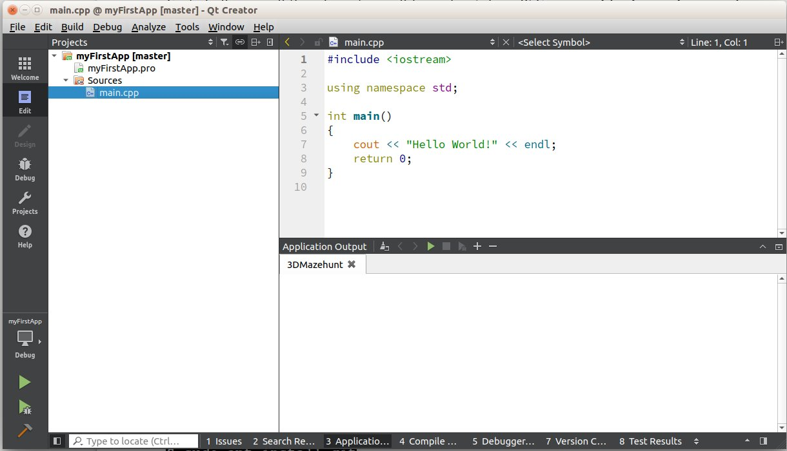
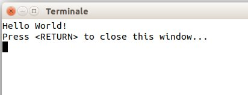

# How to Use Qt Creator for C/C++ Game Programming

These instructions are to help people running the programs described in the book 
***"The Fundamentals of C/C++ Game Programming: Using Target-based Development on SBC’s"*** from ***Brian Beuken*** 
(http://www.scratchpadgames.net/) on *x86_64 Linux* (I use ***Ubuntu*** but on other distribution should work too)
using *Qt Creator* as the *IDE*. 

***Disclaimer (Please Brian, tell me what to write here !!)***

If anyone is interested I can later detail how to use *Qt Creator* also on the ***Raspberry Pi***.

As usual, we have to fight a little with the first setup phase but after that we will have a very
friendly development environment that can offer many useful supports to the programmer.

**Let’s start !**

From the *Qt* site (http://www.qt.io/download) download an up to date version of *Qt* (version 5.12 at the date I’m writing).

You can choose between a free, open source version or a commercial one (in case you plan to distribute your work). I’ll go with the *Open Source* one (I’m only learning!).

You will download a file whose name will resemble *“qt-unified-linux-x64-3.0.6-online.run”*. Open a terminal on the containing directory and make it executable by issuing the following command:

`chmod +x qt-unified-linux-x64-3.0.6-online.run`

Then you may execute, as *superuser*, the program and install *Qt*. The command is:

`sudo ./qt-unified-linux-x64-3.0.6-online.run`

The installation requires an internet connection and takes some time to complete. Once your fresh copy of *Qt* is installed you can start *Qt Creator* and create your first project.

If you don’t find the *qtcreator* application simply click on the  button and search for it. 

**Now for the tricky part…**

The very first time you run *qtcreator* you **could** have to specify which tools (in *qtcreator* terms they are called *Kits*) you would like to use as C, C++ compiler and as debugger. Don’t worry if you fail at first: you can ever amend your configuration without problems.


In the menu bar, select *Tools→Options...* A Dialog will appear allowing to set a lot of different options. The one we are interested in is the *Kits* one.

 

In the above image you will see some already installed kits but chances are that no kit is defined in your fresh installation. If this is the case, click *Add* to add one.

Way too many options can be set but to avoid an annoying long discussion is better to look at the following image and try to reproduce the values shown:



When everything is OK press *Apply* and you are ready to start your first project.

In the Menu bar click on *File → New File or Project* then in the appearing dialog choose *Non-Qt Project* and *Plain C++ Application*



Click on *Choose* and a new dialog will appear that allows to assign a name and a path for our new application.



Click *Next* and leave *qmake* as the *Build system* as shown in the next dialog:



Another dialog will appear allowing to choose the *Kit* (or *Kits*) to use for building your project. Choose the one you have set in the setup phase:



Clicking *Next* will shows the last Dialog allowing to choose a *“Source Version Control System”* to use (I’ll not go into this but I warmly suggest you to use one as suggested in the *Brian’s* book).



Now you will enter the developing environment with a skeleton of your first application.



Just to be sure of having the system up and running click on the 
 button and run the program.

A terminal will open and your first *Hello World* should appear:



Now that we are sure that our *Qt Creator* is able to find all the tools needed to compile, link and run our program we may proceed to set up the environment needed for our game development.

**The libraries**

We will need some libraries to easy our work. Some libraries are the same suggested in the book as there are versions for both the *Arm* architecture and the *x86-64* one, others are different but don’t be afraid since it is simple to get and install them. The required libraries are:

- `glfw`
- `glm`
- `glew`
- `stb` 
- `bullet`

Please refer to the *Brian’s* book for the library installation. My suggestion is to have a sub‑folder (which I call `external`) of my main folder in which to place all the required libraries. This can made easier the finding of the headers and *lib* files.

Regarding the `glfw` library you can download the *Linux* sources from:

https://www.glfw.org/download.html

Follow the instructions to compile the library from the sources.

You need a few more libraries to develop *OpenGL* applications but don’t panic! They are easily downloaded by issuing the following command from a terminal window:

`sudo apt install libglu1-mesa-dev libxrandr-dev libxinerama-dev libxcursor-dev libxi-dev`

If you don’t have bullet installed on your system please install it with this command:

`sudo apt install libbullet-dev`

Now that you have all the needed libraries and support files on your computer you can start enjoying your new IDE.


If you look at the folder of your first program (the one we have made to check the *Qt* installation)
you will find a file with the extension `.pro`.

It acts like a *Makefile* indicating *Qt Creator* which *tools*, *\#include folder*, *library folder* and *library files*
to use for building your application.

All the magics stay there.

The simplest way to proceed is to start with a skeleton of a `.pro` you may copy and personalize.

Here is such a skeleton (*copy* and *paste* in a file with the `.pro` extension):


```
\# This is just a comment ! (All character following the \# are comments)
TEMPLATE = app
CONFIG += console c++14
CONFIG -= app_bundle
CONFIG -= qt

\# Here we define the paths the compiler look for the include files
\# You have to change the paths accordingly to your system configuration !
INCLUDEPATH += ./Headers
INCLUDEPATH += ../external/glfw-3.1.2/include/
INCLUDEPATH += ../external/glm-0.9.9.3/
INCLUDEPATH += ../external/glew-1.13.0/include
INCLUDEPATH += ../external/stb/
INCLUDEPATH += /usr/include/bullet

\# Here are specified the paths the linker look for the library files.
\# You have to change the paths accordingly to your system configuration !
LIBS += -L/usr/lib
LIBS += -L../build/external
LIBS += -L../build/external/glfw-3.1.2/src

\# Here are listed the required libraries (as usual the lib prefix is omitted)
\# As an example the first row point to the libglfw3.a
LIBS += -lglfw3            # libglfw3.a
LIBS += -lX11              # libX11.so
LIBS += -lGLEW_1130        # libGLEW_1130.a
LIBS += -lpthread          # libpthread.a
LIBS += -lGL               # libGL.so
LIBS += -ldl               # libdl.so
LIBS += -lXxf86vm          # libXxf86vm.so
LIBS += -lXrandr           # libXrandr.so
LIBS += -lXinerama         # libXinerama.so
LIBS += -lXcursor          # libXcursor.so
LIBS += -lXi               # libXi.so
LIBS += -lLinearMath       # libLinearMath.so

\# For The Bullet Library
LIBS += -lBulletDynamics   # libBulletDynamics.so
LIBS += -lBulletCollision  # libBulletCollision.so
LIBS += -lLinearMath       # libLinearMath.so

\# Here will be listed the source files of your application
SOURCES += myGame.cpp

\# Here will be listed the header files of your application
HEADERS += 

\# Here will be listed the resource files of your application
RESOURCES +=

\# Here will be listed the other files your application requires
DISTFILES +=
```

Make a new folder and copy the `.pro` file (that you have renamed as you prefer) in that folder.

Let’s pretend to have named it `myGame.pro`, open this file from the *File* menu of *Qt Creator*: you will have a new empty 
project to which you can add all the files you need.


